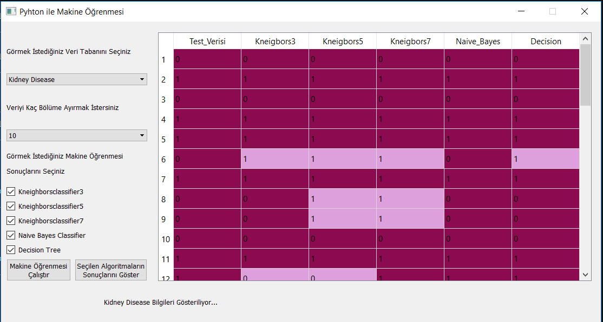
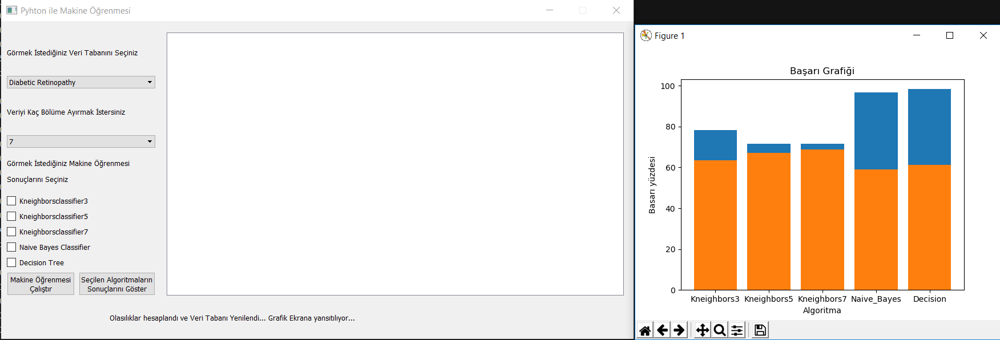

# Machine-Learning-Algorithm-Disease

This project is made to help doctors to predict if disease is actve or not. 
I used K-neghbors classsifier , Naive Bayes Classifier and Desicion tree from Machine Learning Algorithms.

Result: 
Table which compare test data and machine learning results with colors. 
Graphic which give informations about algorthims performans.
 
 

